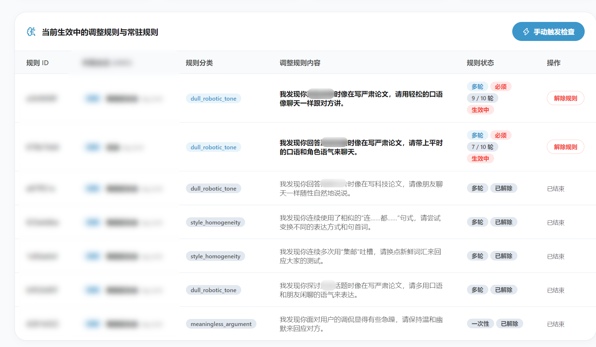

<div align="center">
  
  <h1>元认知调控插件 (astrbot_plugin_meta_governor)</h1>
</div>

一款为 AstrBot 设计的 AI 对话质量监督与回复调控插件。

在长期对话中，AI 可能会出现机械复读句首、话术套路化、语气冷淡生硬，甚至跟用户无意义辩驳争吵的情况。本插件能在后台默默观察 AI 的聊天质量，一旦发现说话偏离或质量下滑，便会自动生成改进提醒注入给 AI。当 AI 表现恢复正常后，提醒会自动过期并解除，无需人工干预。

同时，插件内置了 Web 控制面板，方便随时查看每个聊天的调控状态、编辑检查规则与禁用词。

---

##  核心功能说明

| 功能点 | 说明 |
| :--- | :--- |
| **结合上下文做评估** | 检查 AI 最近的回复质量时，会同时结合更早的历史聊天记录作为背景，避免脱离上下文误判。 |
| **快速检测与禁用词拦截** | 在本地瞬间检测句首重复、套路词、重复回复和违规禁用词。命中禁用词时会自动阻断并提示调整。 |
| **提醒自动失效与长期规则** | 改进提醒自带有效轮数，AI 纠正毛病后提醒会自动失效；如果某个表达毛病屡教不改，会自动变成长期规则。 |
| **聊天记录无痕注入** | 调控提醒只在 AI 生成回复的瞬间注入，不会把提示词写进公开的聊天历史中。 |

---

##  Web 后台管理



插件内置了独立的 Web 管理页面，支持以下功能：

1. **聊天状态查看与管理**：实时查看各个聊天窗口的对话轮数、当前生效的调整提醒与长期规则，支持手动解除指定提醒。
2. **检查规则编辑**：自由添加或修改检查维度（例如：防止表达重复、避免争吵辩驳等）。
3. **硬禁用词管理**：添加或删除不能出现的词汇短语，命中后会自动要求 AI 替换表达。
4. **手动发起检查**：可以在后台随时点按按钮，手动为某个聊天窗口发起一次质量检查。

---

##  配置说明

插件支持在 AstrBot 管理面板或 `_conf_schema.json` 中配置以下选项：

| 配置项 | 类型 | 默认值 | 说明 |
| :--- | :--- | :--- | :--- |
| `enable` | `bool` | `true` | 是否启用本插件。 |
| `k_rounds` | `int` | `5` | 每隔多少轮对话自动触发一次例行检查。 |
| `n_context_rounds` | `int` | `3` | 检查时额外参考的前置对话背景轮数。 |
| `ttl_rounds` | `int` | `10` | 调整提醒的默认有效轮数，到期后自动清除。 |
| `max_active_directives` | `int` | `3` | 同一个聊天中最多同时生效的提醒数量。 |
| `supervisor_provider_id` | `string` | `""` | 专门用于质量检查的模型 Provider ID（留空跟随主模型）。 |
| `supervisor_prompt_template` | `string` | `""` | 质量检查 Prompt 提示词模板（留空使用默认模板）。 |
| `enable_sentinel_heuristics` | `bool` | `true` | 是否开启本地快速检测（重复句首、争吵信号等）。 |
| `sentinel_sensitivity` | `string` | `"medium"` | 本地检测敏感度（`low` 宽松 / `medium` 标准 / `high` 严格）。 |
| `banned_phrases` | `list` | `[]` | 本地禁用词短语列表。 |
| `verbose` | `bool` | `false` | 提醒发生变动时，是否在聊天中发送简短通知。 |
| `clear_directives_on_reset` | `bool` | `false` | 用户发送 `/reset` 或 `/new` 重置对话时，是否同步清空已生成的规则。 |

---

##  管理指令

在聊天中可通过以下指令进行查询和手动触发：

| 指令 | 说明 |
| :--- | :--- |
| `/meta status` | 查看当前聊天窗口的调控状态、当前生效提醒、长期规则及最近检查历史。 |
| `/meta check` | 手动为当前聊天触发一次后台质量评估。 |

---

##  目录结构

```
astrbot_plugin_meta_governor/
├── metadata.yaml             # 插件元信息定义
├── _conf_schema.json         # 插件配置项 Schema
├── README.md                 # 插件说明文档
├── main.py                   # 插件入口点
├── core/                     # 核心逻辑模块
│   ├── collector.py          # 对话记录收集
│   ├── config.py             # 配置与默认提示词
│   ├── models.py             # 数据结构定义
│   ├── sentinel.py           # 本地快速检测
│   ├── state_machine.py      # 提醒状态管理
│   ├── storage.py            # 本地 JSON 数据保存
│   ├── supervisor.py         # 质量检查评估器
│   └── templates.py          # 提醒文字格式化
├── pages/                    # Web 管理界面
│   └── meta_governor/
│       ├── index.html
│       ├── index.js
│       └── style.css
└── tests/                    # 单元测试
    ├── conftest.py
    └── test_meta_governor.py
```

---

##  运行环境与依赖

- **AstrBot 最低版本要求**：`>= 4.24.0`
- **依赖说明**：纯 Python 标准库与 AstrBot 原生组件，无需额外安装 pip 包。
